# SAT-UNET: Official Repository

This is the official implementation of the SAT-UNET model, as described in our paper:  
**[GhalamClouds: Remote Sensing docs/images for Kazakhstan and Clouds Segmentation Using SAT-UNet](https://www.sciencedirect.com/science/article/pii/S0273117725011299)**

---

## Description

SAT-UNET is a deep learning model for cloud semantic segmentation, designed for remote sensing imagery. This repository provides all necessary code, configuration files, and utilities to train, validate, and infer with SAT-UNET, including multi-GPU support and experiment logging.

---

## Project Structure

- [`checkpoints/`](checkpoints/)  
  Saved model weights and checkpoints.

- [`configs/`](configs/)  
  YAML configuration files for experiments (e.g., [`satunet.yml`](configs/satunet.yml)).

- [`data/`](data/)  
  Data loading, augmentation, and dataset definitions.

- [`docs/`](docs/)  
  Documentation and requirements.

- [`models/`](models/)  
  Model architectures, attention modules, and custom loss functions.

- [`utils/`](utils/)  
  Utility scripts for logging, checkpointing, patch merging, and more.

- [`train.py`](train.py)  
  Main training script.

- [`inference.py`](inference.py)  
  Inference script for running predictions on new data.

- [`train_multi_gpu.py`](train_multi_gpu.py)  
  Multi-GPU training is envoked by choosing `multi_gpu` parameter in `training.type` of YAML configuration file.

- [`trainer.py`](trainer.py)  
  Single-GPU training is envoked by choosing `torch` parameter in `training.type` of YAML configuration file.

---

## Dataset Structure

The dataset should be organized into **train**, **valid**, and **test** (optional) folders.  
Each split contains subfolders named after each color band (prefixes `train_`, `valid_`, `test_`). Example structure:

├──Dataset Root Folder
\
│------------├──train_red  
│------------├──train_green  
│------------├──train_blue  
│------------├──train_nir  
│------------├──train_gt
\
│
\
│------------├──valid_red  
│------------├──valid_green  
│------------├──valid_blue  
│------------├──valid_nir  
│------------├──valid_gt

---

## Sat-UNet Architecture

Here is the visual diagram of our proposed Sat-UNet model.

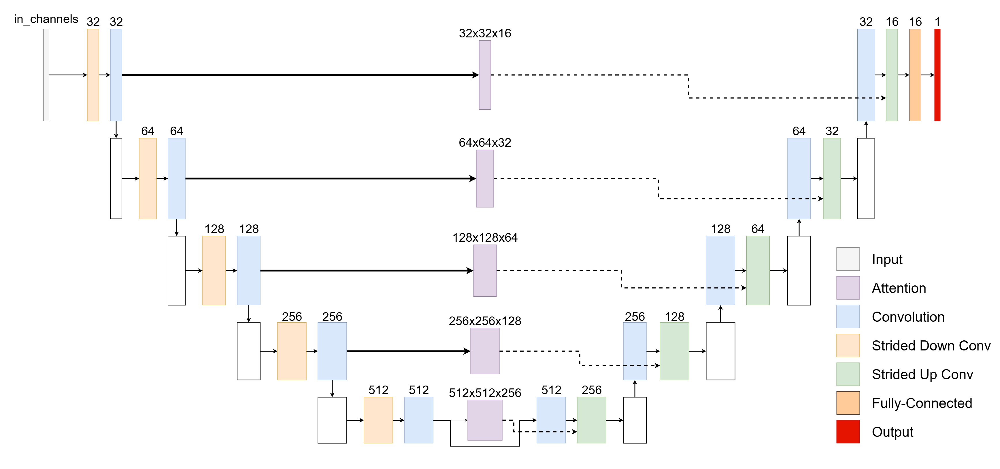

## Spatial Attention Block

Here is the visual diagram of our proposed NLP-inspired attention block for Sat-UNet model.

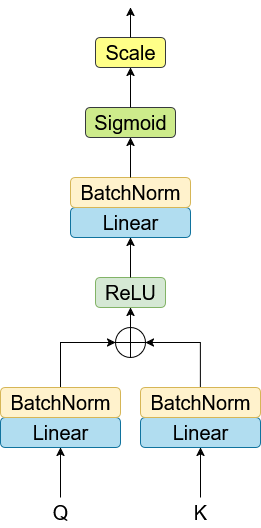

---

## Ablation Results

We performed ablation study with our attention mechanism. We compare it to WITHOUT Attention, Squeeze-&-Excitation block, and CBAM module.

<table>
  <tr>
	<td>Dataset</td>
    <td>(a) RGB image</td>
    <td>(b) Ground Truth</td>
    <td>(c) No-Attention</td>
    <td>(d) SE</td>
    <td>(e) CBAM</td>
    <td>(f) Proposed</td>
  </tr>
  <tr>
	<td>Cloud-38</td>
    <td>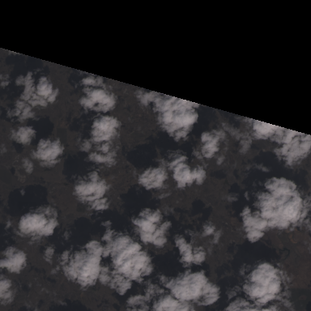</td>
    <td>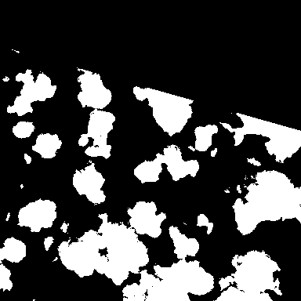</td>
    <td>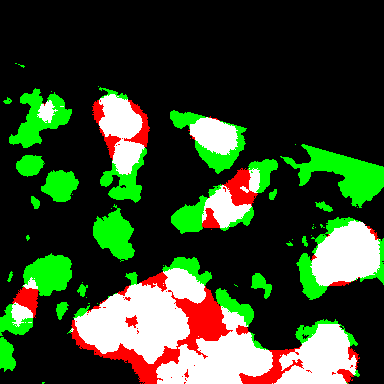</td>
    <td>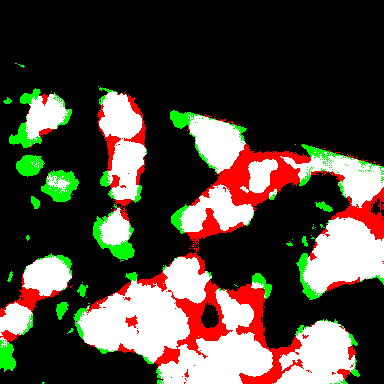</td>
    <td>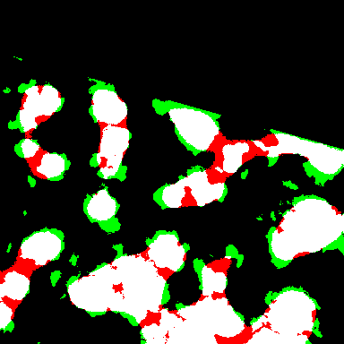</td>
    <td>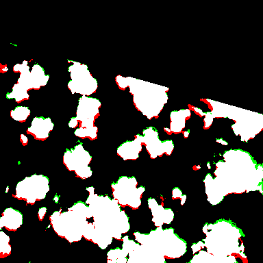</td>
  </tr>
  <tr>
  	<td>Cloud-95</td>
    <td>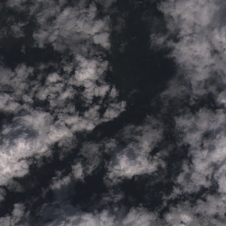</td>
    <td>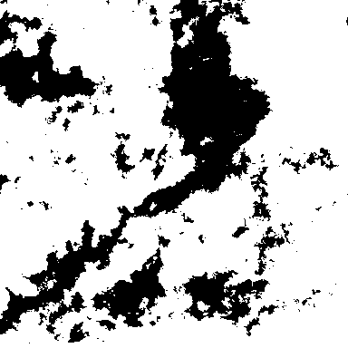</td>
    <td>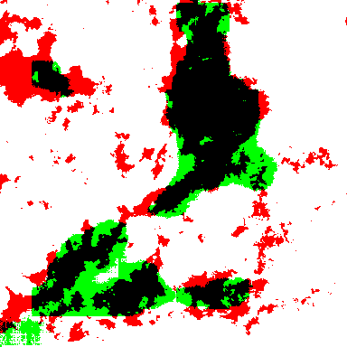</td>
    <td>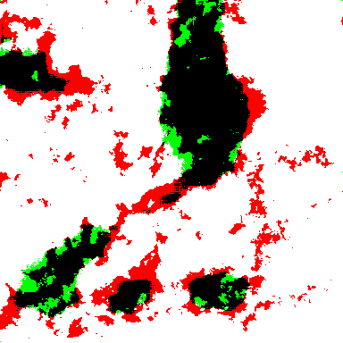</td>
    <td>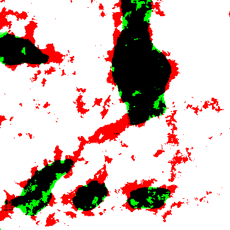</td>
    <td>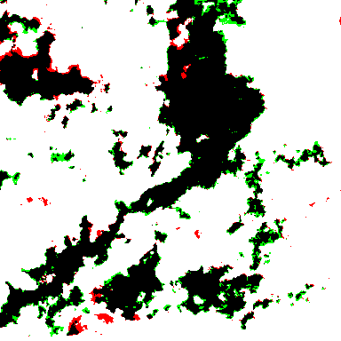</td>
  </tr>
  <tr>
  	<td>GhalamClouds80</td>
    <td>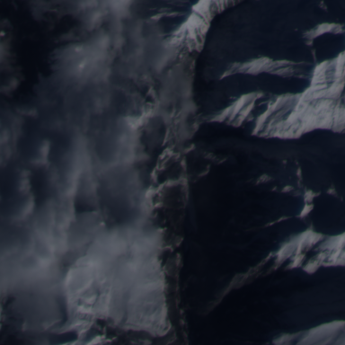</td>
    <td>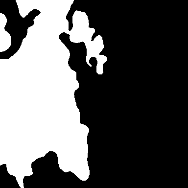</td>
    <td></td>
    <td>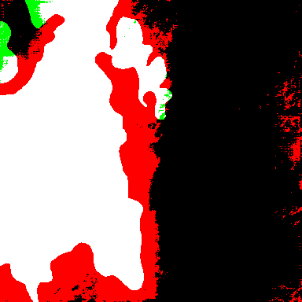</td>
    <td>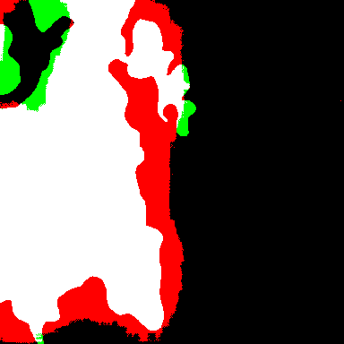</td>
    <td>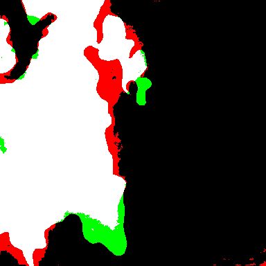</td>
  </tr>
  <tr>
  	<td>GhalamClouds220</td>
    <td></td>
    <td>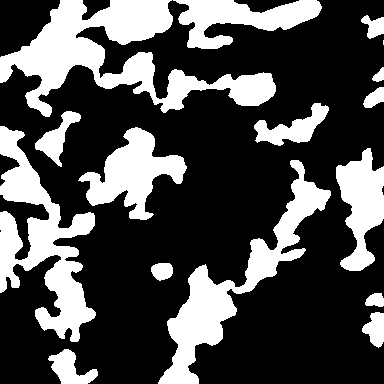</td>
    <td></td>
    <td>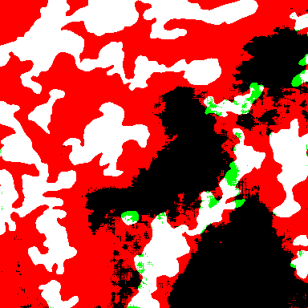</td>
    <td>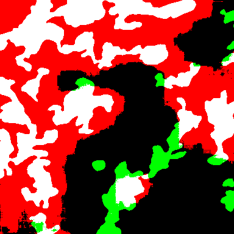</td>
    <td>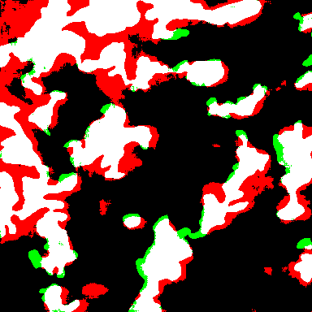</td>
  </tr>
</table>

---

## Configuration

All experiment parameters are set in the YAML config file, e.g., [`configs/satunet.yml`](configs/satunet.yml).  
**To replicate experiments or run your own:**

- **Model parameters:**  
  - `xp_config.model_name`: Model to use (e.g., `SatUNet`)
  - `model.in_channels`, `model.out_channels`: Input/output channels

- **Training parameters:**  
  - `training.type`: Training mode (`lightning`, `torch`, or `multi_gpu`)
  - `training.multi_gpu.world_size`: Number of GPUs for multi-GPU training
  - `trainer.max_epochs`: Number of training epochs
  - `trainer.precision`: Precision (e.g., `bf16-mixed`)

- **Data parameters:**  
  - `data.data_root`: Path to dataset
  - `data.train_colors`, `data.valid_colors`: Folder names for each modality
  - `data.train_batch_size`, `data.valid_batch_size`: Batch sizes

- **Optimization:**  
  - `model.optim_params`: Optimizer settings (type, learning rate, weight decay, etc.)

- **Early Stopping**
  - `early_stop.patience`: Number of epochs to stop training when validation loss doesn't improve

- **Logging:**  
  - `logs.type`: Logging backend (`comet`, `tb_logs`, etc.)
  - `logs.comet.api_key`: Set your Comet API key (can be set via environment variable `COMET_API_KEY`)
  - NOTE: in `train.py` comment out 35-36 lines to NOT LOG your COMET API KEY.

**Change these parameters as needed to match your experimental setup.**

---

## Setup

- Python 3.12.7
- CUDA 12.1
- CUDNN 8.9.7

---

## How to Run Training

1. **Install dependencies:**
```sh
	pip install -r docs/requirements.txt
```

2. **Run training**
```py
  export COMET_API_KEY=YOUR_API_KEY
	python3 train.py -p configs/satunet.yml
```

## How to Run Inference

1. **No thresholding (probability map)**
```py
	python3 inference.py -d DataFolder -p configs/satunet.yml -c checkpoints/model.ckpt -s results
```

2. **Thresholding**
```py
	python3 inference.py -d DataFolder -p configs/satunet.yml -c checkpoints/model.ckpt -t 0.5 -s results
```

---

## Citation

If you use GhalamClouds datasets and/or SAT-UNET in your research, please cite our paper:
```bib
	@article{AIMYSHEV2025,
    title = {GhalamClouds: Remote Sensing Images for Kazakhstan and Clouds Segmentation Using SAT-UNet},
    journal = {Advances in Space Research},
    year = {2025},
    issn = {0273-1177},
    doi = {https://doi.org/10.1016/j.asr.2025.09.098},
    url = {https://www.sciencedirect.com/science/article/pii/S0273117725011299},
    author = {Dias Aimyshev and Beket Tulegenov and Berik Smadyarov and Darkhan Nurzhakyp},
    keywords = {Attention, Deep Learning, Image Processing, Remote Sensing, UNet},
    abstract = {Cloud detection and segmentation represent a fundamental step in the analysis of optical remote sensing data. However, the performance of deep learning models heavily depends on the availability of task-specific datasets, which are often lacking. To address these challenges, we introduce two versions of the GhalamClouds dataset, derived from KazSTSat imagery, containing over 40,000 manually annotated cloud patches across six spectral channels and diverse landscapes of Kazakhstan. We also propose Sat-UNet, a U-Net backbone augmented with a spatial attention block designed to refine skip connections. Extensive experiments demonstrate that proposed model confidently competes with state-of-the-art models with significantly less parameters. Ablation studies further show that the proposed attention mechanism consistently outperforms the baseline UNet as well as SE and CBAM modules, with notable gains in F1 score, AUC, and Accuracy. We expect that GhalamClouds and Sat-UNet will provide valuable resources for advancing cloud segmentation research and improving model robustness in remote sensing applications.}
}
```